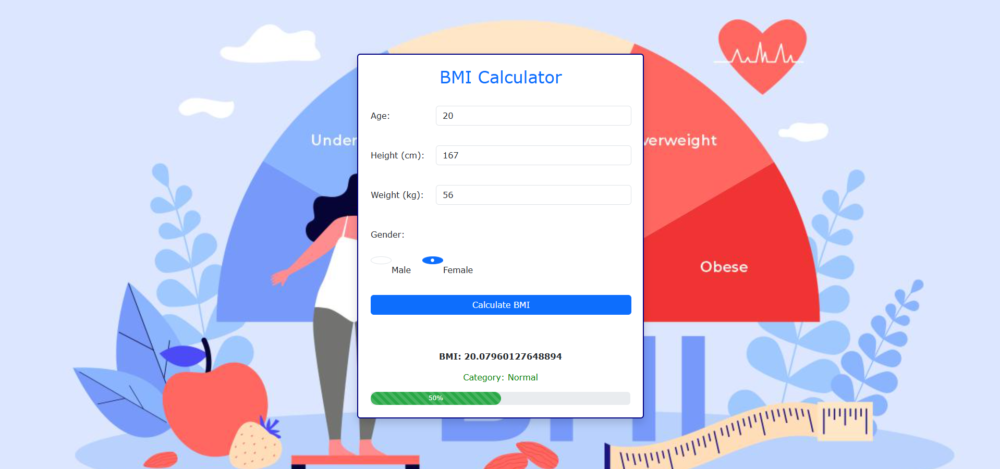

# bmi-calculator
# 🧮 BMI Calculator
A simple and responsive Body Mass Index (BMI) calculator built with **HTML**, **CSS**, **JavaScript**, and **Bootstrap 5**. It allows users to input their age, height, weight, and gender to calculate their BMI and receive a health category based on the result.

## 🚀 Features
- Input validation for age, height, weight, and gender
- Real-time BMI calculation
- Categorizes result (Normal, Overweight, etc.)
- Animated progress bar based on BMI value
- Responsive design using Bootstrap
- Background image with hover opacity effect

## 📸 Demo

## 💡 Technologies Used
- HTML5
- CSS3
- JavaScript (Vanilla)
- Bootstrap 5

## 🧑‍💻 Author
Yaatri